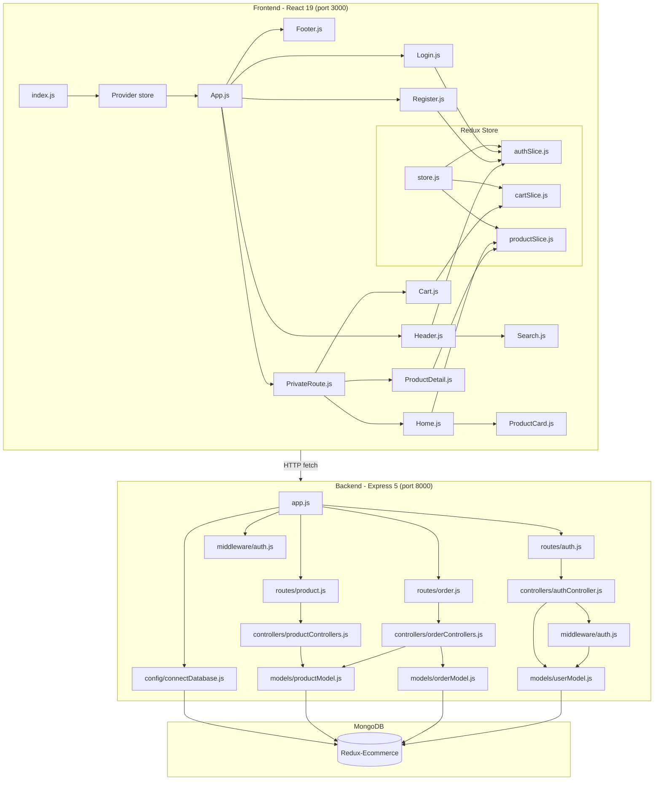
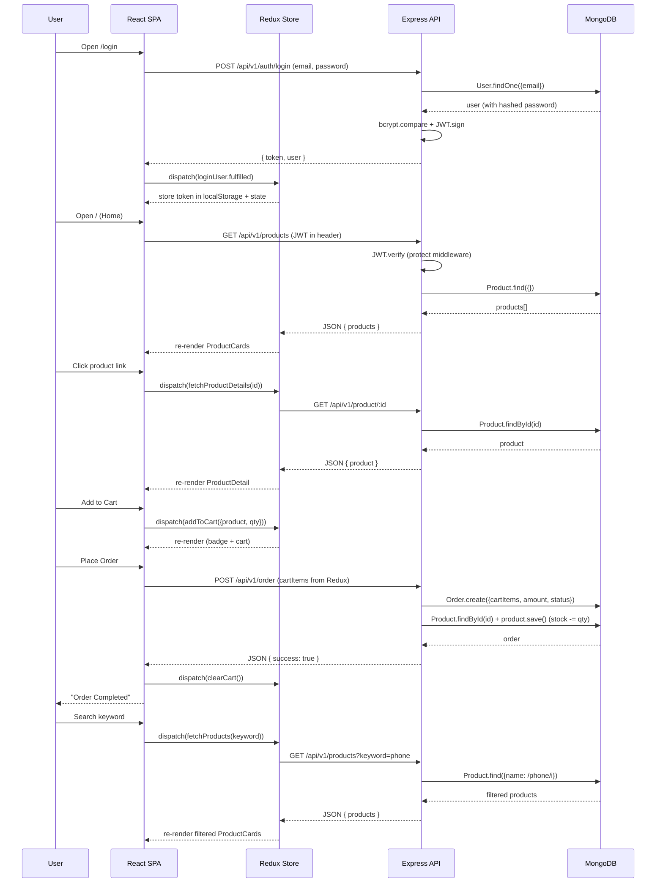
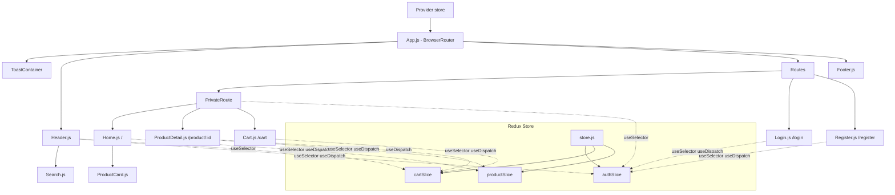

# JVLcart Architecture

## System Overview



## Data Flow



## File Dependency Graph

```
frontend/public/index.html
  └── (loads React bundle via CRA)

frontend/src/index.js
  ├── React
  ├── ReactDOM
  ├── ./index.css
  ├── ./store/store              → Redux Provider wrapper
  │     ├── @reduxjs/toolkit (configureStore)
  │     ├── ./authSlice          → authSlice.reducer
  │     ├── ./cartSlice          → cartSlice.reducer
  │     └── ./productSlice       → productSlice.reducer
  └── ./App

frontend/src/App.js
  ├── ./App.css                          (styling)
  ├── ./components/PrivateRoute          (route guard — checks JWT token)
  │     ├── react-redux (useSelector)
  │     └── react-router-dom (Navigate)
  ├── ./components/Header                (nav bar, reads Redux cart + logout)
  │     ├── ./Search                     (keyword input)
  │     │     ├── react (useState)
  │     │     └── react-router-dom (useNavigate)
  │     ├── react-redux (useSelector, useDispatch)
  │     ├── ../store/authSlice (logout)
  │     └── react-router-dom (Link)
  ├── ./components/Footer                (static footer)
  ├── ./pages/Home                       (product listing from Redux, requires auth)
  │     ├── react (useEffect)
  │     ├── react-router-dom (useSearchParams)
  │     ├── react-redux (useDispatch, useSelector)
  │     ├── ../store/productSlice (fetchProducts async thunk)
  │     └── ../components/ProductCard    (card UI)
  │           └── react-router-dom (Link)
  ├── ./pages/ProductDetail              (product details + add to cart, requires auth)
  │     ├── react (useEffect, useState)
  │     ├── react-router-dom (useParams)
  │     ├── react-redux (useDispatch, useSelector)
  │     ├── ../store/productSlice (fetchProductDetails async thunk)
  │     ├── ../store/cartSlice (addToCart action)
  │     └── react-toastify (toast)
  ├── ./pages/Cart                       (cart management + order, requires auth)
  │     ├── react (useState)
  │     ├── react-redux (useDispatch, useSelector)
  │     ├── ../store/cartSlice (increaseQty, decreaseQty, removeFromCart, clearCart)
  │     └── react-router-dom (Link)
  ├── ./pages/Login                      (login form)
  │     ├── react (useEffect, useState)
  │     ├── react-redux (useDispatch, useSelector)
  │     ├── ../store/authSlice (loginUser async thunk, clearError)
  │     └── react-router-dom (useNavigate)
  ├── ./pages/Register                   (registration form)
  │     ├── react (useEffect, useState)
  │     ├── react-redux (useDispatch, useSelector)
  │     ├── ../store/authSlice (registerUser async thunk, clearError)
  │     └── react-router-dom (useNavigate)
  ├── react-router-dom (BrowserRouter, Routes, Route)
  └── react-toastify (ToastContainer, CSS)

backend/app.js (entry point)
  ├── dotenv         →  backend/.env
  ├── express
  ├── cors
  ├── express.json()
  ├── express.static(frontend/public)
  ├── ./config/connectDatabase
  │     └── mongoose  →  backend/.env (DB_URL)
  ├── ./routes/product
  │     └── ../controllers/productControllers
  │           └── ../models/productModel → mongoose
  ├── ./routes/order
  │     └── ../controllers/orderControllers
  │           ├── ../models/orderModel  → mongoose
  │           └── ../models/productModel → mongoose
  └── ./routes/auth
        └── ../controllers/authController
              ├── ../models/userModel → mongoose (bcrypt)
              └── ../middleware/auth
                    └── jsonwebtoken (JWT.verify)

```

## Route Map

| Method | URL | Component / Controller | Description |
|--------|-----|----------------------|-------------|
| `GET` | `/` | `Home.js` (via PrivateRoute) | Product listing page (Redux) |
| `GET` | `/search?keyword=...` | `Home.js` (via PrivateRoute) | Filtered product listing (Redux) |
| `GET` | `/product/:id` | `ProductDetail.js` (via PrivateRoute) | Single product details (Redux) |
| `GET` | `/cart` | `Cart.js` (via PrivateRoute) | Shopping cart (Redux) |
| `GET` | `/login` | `Login.js` | Login page |
| `GET` | `/register` | `Register.js` | Register page |
| `GET` | `/api/v1/products` | `getProducts` | API: all/filtered products |
| `GET` | `/api/v1/product/:id` | `getSingleProduct` | API: single product |
| `POST` | `/api/v1/order` | `createOrder` | API: place order |
| `POST` | `/api/v1/auth/register` | `register` | API: register user |
| `POST` | `/api/v1/auth/login` | `login` | API: login, returns JWT |
| `GET` | `/api/v1/auth/profile` | `getProfile` (protect) | API: get user profile |

## State Management (Redux Toolkit)

```
store.js (configureStore)
  ├── auth: authSlice.reducer
  │     └── initialState: { token: localStorage.getItem('token'), user: null, status: 'idle', error: null }
  │     └── async thunks: registerUser, loginUser, fetchProfile
  │     └── reducers: logout, clearError
  │     └── consumed by: Login.js, Register.js, Header.js (logout), PrivateRoute.js (token check)
  │
  ├── cart: cartSlice.reducer
  │     └── initialState: { items: [] }
  │     └── reducers: addToCart, increaseQty, decreaseQty, removeFromCart, clearCart
  │     └── consumed by: Header.js (badge), ProductDetail.js (addToCart), Cart.js (display/modify/order)
  │
  └── products: productSlice.reducer
        └── initialState: { products: [], product: null, loading: false, error: null }
        └── async thunks: fetchProducts, fetchProductDetails
        └── consumed by: Home.js (product list), ProductDetail.js (single product)

index.js
  └── <Provider store={store}> wraps <App />
```

All components access state via `useSelector()` and dispatch actions via `useDispatch()` — no prop drilling.

## Component Tree



## Key Configuration

| File | Key Settings |
|------|-------------|
| `backend/.env` | PORT=8000, NODE_ENV=Development, DB_URL=mongodb://localhost:27017/Redux-Ecommerce, JWT_SECRET=your-secret-key |
| `frontend/.env` | REACT_APP_API_URL=http://localhost:8000/api/v1 |
| `backend/package.json` | Express 5, Mongoose 9, Cors, Dotenv, Bcryptjs 3, JsonWebToken 9, Nodemon (dev) |
| `frontend/package.json` | React 19, React Router DOM 7, Redux Toolkit 2, React Redux 9, React Toastify 11, Axios |
